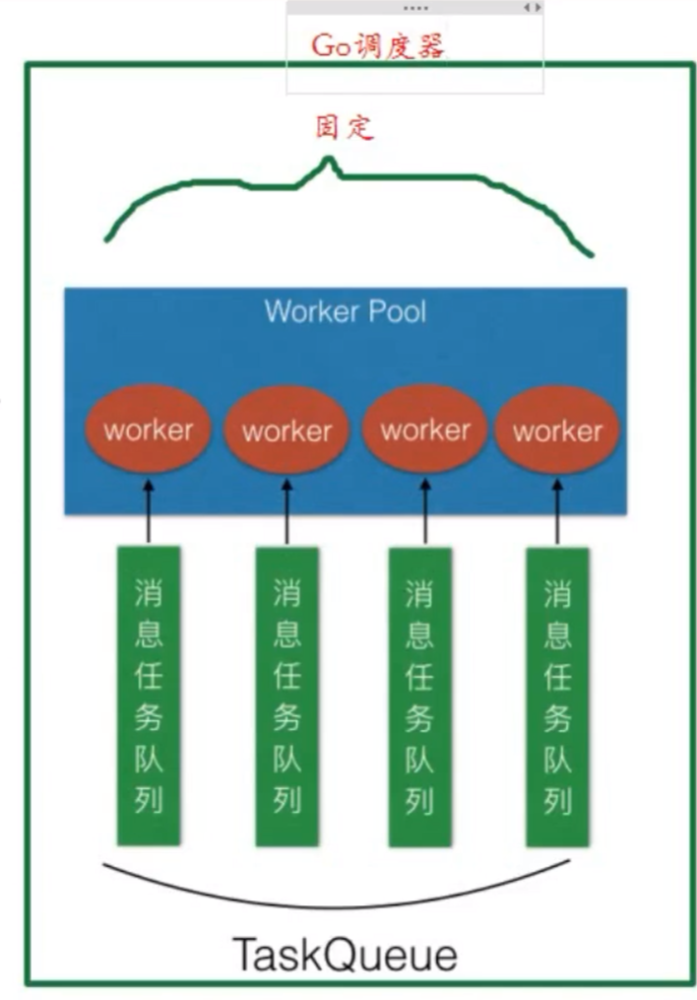

# Learn-zinx

This repository is used to record my process of learning the zinx framework.

zinx framework repository address：[https://github.com/aceld/zinx](https://github.com/aceld/zinx)

## V0.1 基础server模块

> V0.1版本实现了基本的Server服务，实现了消息回显的过程。

文件结构：
- demo： 存放基于框架写的server端和client端用于测试。
- ziface：抽象层
- znet：实现层

基于Golang的net包进行开发：
- net.ResolveTCPAddr：创建TCP的addr
- net.ListenTCP：监听TCPAddr，得到listener
- listener.AcceptTCP：接收客户端的连接，得到conn
- net.Dial：客户端连接服务器，得到conn

server的定义：
- 属性：
  - 服务器名
  - IP地址
  - IP版本
  - 端口
- 方法
  - 启动
  - 暂停
  - 运行

## V0.2 连接封装和业务绑定

连接封装：`connection.go`
- 属性：
  - conn套接字 *net.Conn
  - 连接ID uint32
  - 当前连接状态 bool
  - 与连接绑定的业务方法 handleFunc
  - 异步过程，有个channel捕获退出信号 chan bool
- 方法：
  - 启动连接：启动两个go程
  - 停止连接：关闭套接字和管道
  - 获取当前连接的conn对象
  - 得到连接ID
  - 得到客户端连接地址和端口
  - 发送数据

系统架构设计上分为两个Go程去执行任务，一个负责读业务，一个负责写业务。
V0.2实现了简单的读业务，即回显功能。

server.go在start方法中启动一个go程创建套接字，通过NewConnection实例化connection对象，并通过go程开启这个connection对象的start方法。

connection.go的start方法负责开启读业务和写业务这两个Go程。
目前只实现了读业务的Go程，且业务处理方法的回调在server.go写死，实现写回功能。

## V0.3 基础router模块(单一Router)

### Request请求封装

目的：将conn和数据绑定在一起，以request作为请求的原子操作。
属性：
- 连接 iconnection
- 请求数据
方法：
- 获取当前连接
- 获取当前数据

### Router模块的定义

IRouter：抽象层
- 方法：
  - 处理业务之前的方法
  - 处理业务的方法
  - 处理业务之后的方法

BaseRouter：实现层
实现router时先嵌入BaseRouter，框架使用者根据需求重写这个方法。

### zinx集成Router

1. IServer增添添加路由方法
2. Server添加Router成员，去掉之前的回调。
3. Connection类绑定Router成员，去掉handleAPI
4. Connection中调用Router处理业务——模板方法设计模式

### 测试——使用ZinxV0.3开发

1. 创建server
2. 创建自定义Router，继承BaseRouter，重写三个方法
3. 添加Router
4. 启动Server

## V0.4 全局配置模块

这里以JSON格式为配置文件，用户编写zinx.json。
放到/config/zinx.json中。

内容包括：
- Name：服务器名
- Host：监听的IP地址
- TcpPort：端口
- MaxConn：允许最大客户端数量

### 创建全局配置模块

`utils/globalobj.go`
- 提供全局globalobj对象
- init：读取json配置，序列化到globalobj中

## V0.5 消息封装

### 定义消息结构

定义消息结构：Message
- 属性：
  - 消息ID
  - 消息长度
  - 消息内容
- 方法：
  - set
  - get

### 解决TCP粘包问题

消息的TLV序列化：
一个完整的消息 = Head(DataLen + ID) + Body(Data)

### 将消息封装机制集成到Zinx框架中

1. 将Message添加到request属性中。
2. 修改conn读取数据的机制，将单纯的读取二进制数据改成拆包形式读取。
3. 给conn提供发包机制，将发送的消息进行打包。

## V0.6 多路由机制

### 消息管理模块

消息管理模块：支持多路由业务Api调度。
属性：
- 消息ID和Router的映射表
方法：
- 根据MsgId来调度Router方法
- 添加Router方法到Map集合中

### 消息管理模块集成到Zinx框架中

1. 将Server中的Router属性，替换为MsgHandler属性。
2. 将Server之前的AddRouter替换为MsgHandler的相关API。
3. connection的Router属性替换为MsgHandler
4. connection的startReader中的调度改成MsgHandler的调度方法。

## V0.7 读写分离

1. 添加Writer go-routine
2. 添加Reader协程和Writer协程之间通信的channel
3. 将Reader中的直接写回逻辑改成发送数据给channel
4. 启动Reader和Writer协同工作

## V0.8 消息队列和多任务

### 需求

上个版本的弊端：
客户每次进行连接，流程是先开辟Start协程，Start协程启动DoMsgHandle协程，将数据发送给channel，Writer协程从channel中拿数据。
即每次启动一个新的连接，都需要开辟三个协程。
Reader和Writer是阻塞的，不会占用CPU，但是剩下的一个协程是处理客户端业务，是占用CPU的。

改进：
处理业务的go程改成指定数量的，CPU在调度go程只需要在这几个之间切换即可。

### 实现

1. 创建消息队列
   1. 在MsgHandler中添加属性：消息队列（管道集合）、worker工作池的数量(配置文件配置)
2. 创建多任务Worker工作池并启动
   1. 根据WorkerPoolSize数量，Worker。
   2. 每个Worker都应该用一个Go承载。
   3. 只需要永远阻塞与当前Worker对应的Channel的消息。
   4. 一旦有消息到来，Worker调用路由处理消息。
3. 将之前的发送消息改成消息发送给消息队列和worker工作池进行处理
   1. 定义方法，将消息发送给工作池的队列。
   2. 设计算法，保证每个Worker受到任务的均衡的。这里做一个简单的平均分配。
   3. 让哪个Worker处理，只需要将request请求发送给对应的taskQueue即可。
4. 将消息队列集成到zinx
   1. 开启并调用消息队列以及工作池，创建Server的时候就开启。
   2. 将从客户端处理的消息发送给当前Worker的工作池来处理。

